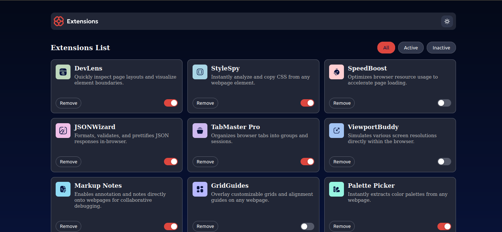
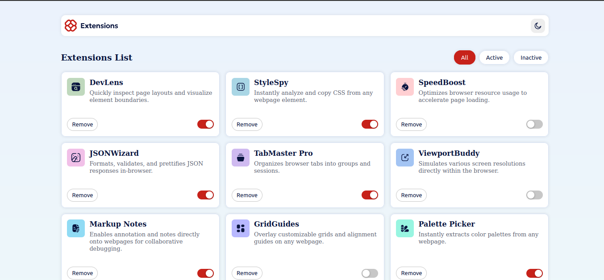
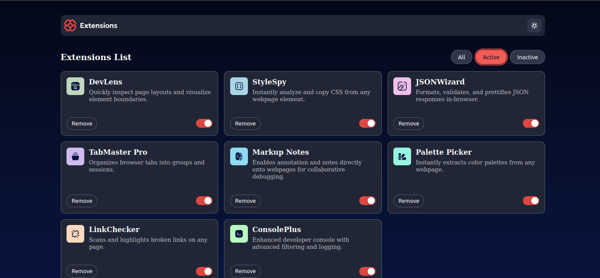
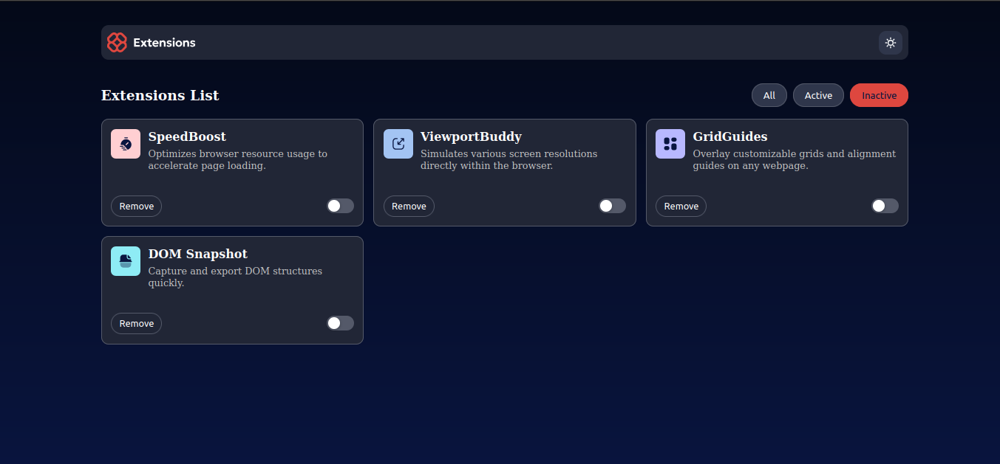

# Frontend Mentor - Social links profile solution

Esta é uma solução para o 
 [Desafio da Interface do gerenciador de extensões do navegador no Frontend Mentor](https://www.frontendmentor.io/challenges/browser-extension-manager-ui-yNZnOfsMAp). Os desafios do Frontend mentor ajudam você a melhorar as suas habilidades de programação através da construção de projetos realísticos.

## Tabela de conteúdos

- [Visão geral](#visão-geral)
  - [O desafio](#o-desafio)
  - [Imagens do projeto feito](#imagens-do-projeto-feito)
  - [Links](#links)
- [Construído com](#construído-com)
- [Autor](#autor)

##  Visão Geral

## O desafio

O desafio consistia em criar a interface do usuário de um gerenciador de extensões do navegador e torná-la o mais próxima possível do design fornecido.

Foi fornecido pelo site os dados das extensões em um arquivo data.json local. Eu os utilizei para adicionar os dados dinamicamente.

Os usuários são capazes de:

- Alternar extensões entre os estados ativo e inativo
- Filtrar extensões ativas e inativas
- Remover extensões da lista
- Selecionar o tema de cores (dark ou light)
- Visualizar o layout ideal para a interface, dependendo do tamanho da tela do dispositivo
- Ver os estados de foco e hover para todos os elementos interativos na página

### Imagens do projeto feito

Imagem do tema dark

Imagem do tema light

Imagem do filtro ativo selecionado

Imagem do filtro inativo selecionado

### Links

- Solução URL: [URL da solução](https://github.com/moisesferreira123/browser-extensions-manager-ui-main)
- Live Site URL: [Live site URL]()

## Construído com

- HTML5
- CSS
- JavaScript
- Visual Studio Code

## Autor

- Frontend Mentor - [@moisesferreira123](https://www.frontendmentor.io/profile/moisesferreira123)
- GitHub - [@moisesferreira123](https://github.com/moisesferreira123)
